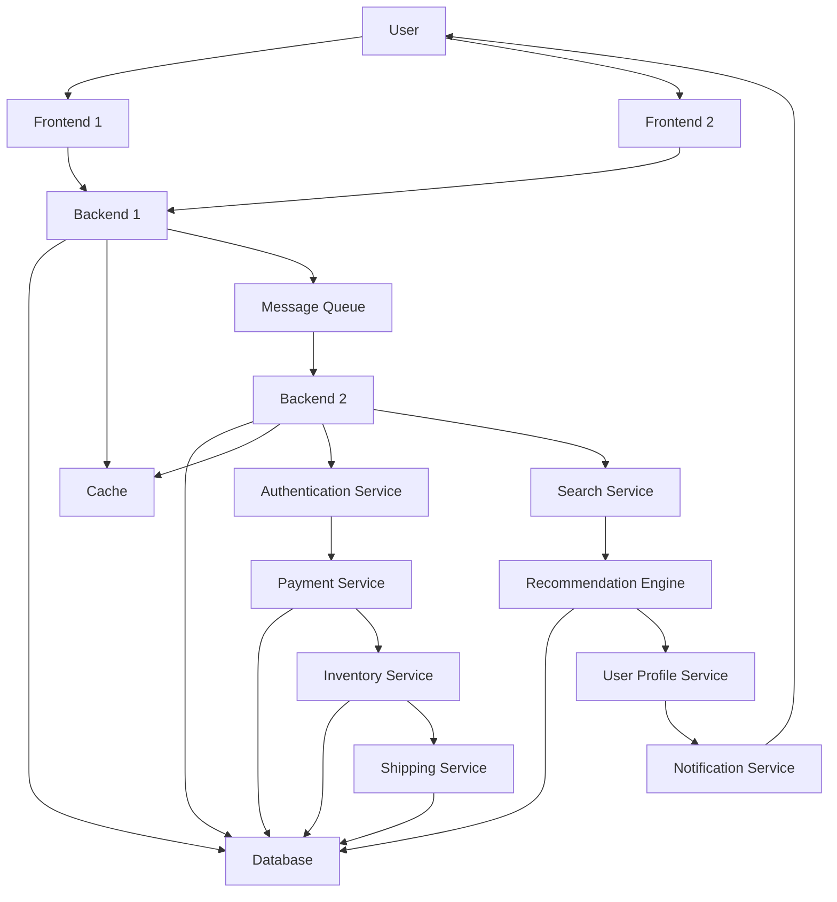

# Terraform

## Table of Contents

- [Getting Started](#getting-started)
  - [Prerequisites](#prerequisites)
  - [Installation](#installation)
- [Usage](#usage)
- [System Architecture](#system-architecture)
- [Contributing](#contributing)
- [License](#license)

## Getting Started

These instructions will get you a copy of the project up and running on your local machine for development and testing purposes.

### Prerequisites

List any necessary dependencies, such as third-party libraries or other tools.

### Installation

Step-by-step instructions on how to install and set up the project.

## Usage

Instructions and examples on how to use the project.

## System Architecture

Use [Mermaid](https://mermaid-js.github.io/) to create a diagram of the project's architecture.

## Contributing
If you would like to contribute to the project, please read [CONTRIBUTING.md](CONTRIBUTING.md) for details on the process.

## License
This project is licensed under the [INSERT NAME OF LICENSE] License - see the [LICENSE.md](LICENSE.md) file for details.
